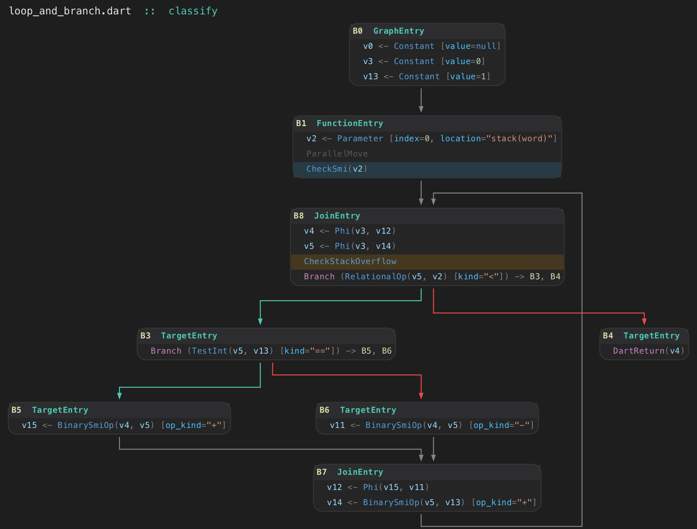
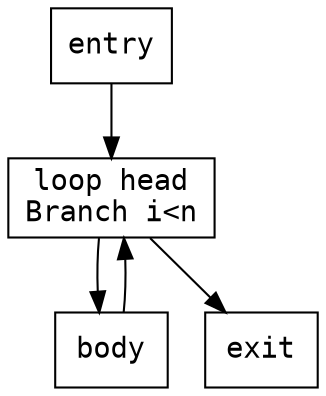

# graphviz `cfg` layout plugin

A standalone, **out-of-tree** graphviz layout engine that lays out control-flow
graphs in the Compiler Explorer / Cutter style: blocks on a grid, edges leaving
the bottom of a block and entering the top of the next, routed as orthogonal
right-angle lanes. Select it with `-Kcfg` (or `layout=cfg`).

It installs into a **stock, unmodified graphviz** — no fork, no rebuild of
graphviz. Everything else (every output format, every other engine) keeps
working normally.

## Example

The optimized IL control-flow graph of a Dart function
(`loop_and_branch.dart :: classify`), rendered with `dot -Kcfg`. The plugin does
the grid layout and orthogonal bottom-to-top edge routing; the per-token syntax
colors, optimizer "heatmap" row tints (e.g. the orange `CheckStackOverflow`
safepoint, the blue `CheckSmi` guard), dimmed plumbing (`ParallelMove`), and
colored branches all come from the input DOT's HTML-like labels. The generating
source is [`example/sample-cfg.dot`](example/sample-cfg.dot) — reproduce it with
`dot -Kcfg -Tpng example/sample-cfg.dot -o out.png`.



## Build & install

Requires a graphviz install discoverable via `pkg-config --exists libgvc`
(e.g. `brew install graphviz`) and a C compiler.

```sh
make            # build the shared library
make install    # copy into graphviz's plugin dir and run `dot -c`
make test       # render a sample CFG
```

Then:

```sh
dot -Kcfg -Tpng yourgraph.dot -o out.png
dot -Kcfg -Tsvg yourgraph.dot -o out.svg
```

`make uninstall` removes it and re-registers the remaining plugins.

## Usage

Standard DOT. One engine-specific attribute:

- `cfgbias=left|right` on an edge picks the vertical routing lane when the left
  and right candidate columns are equidistant. Default is `right`; set `left`
  for the classic "true branch goes left". Example:



## Limitations

- **Ports are ignored.** Edges always route from a block's bottom to the next
  block's top (the CFG convention), so `node:port` / compass-port specs and
  record/HTML cell ports have no effect on where edges attach. They are parsed
  without error, just not honored.
- **Routing-lane spacing** is 18pt rather than upstream's 10pt — a deliberate
  divergence so each edge's final vertical approach stays longer than a rendered
  arrowhead (a 10pt lane lets graphviz's arrow clipping bend the last segment).

## Files

| File | Role |
|---|---|
| `cfg_core.{c,h}` | The layout algorithm. **No graphviz dependency** — a C port of Compiler Explorer's `graph-layout-core` (via the dart-il-explorer project). Sized nodes + edges in, node positions + orthogonal edge polylines out. |
| `cfg_layout.c` | Glue to graphviz: sizes nodes, runs `cfg_core`, writes `ND_coord`, installs edge splines, sets the bounding box, hands off to graphviz's normal post-processing/rendering. |
| `gvplugin_cfg.c` | Plugin registration (`gvplugin_cfg_LTX_library`). |

## How it plugs in (and the one caveat)

graphviz layout engines are plugins: a shared library exporting
`gvplugin_<name>_LTX_library`, discovered via `dot -c`. The public plugin API
(`gvplugin.h`, `gvplugin_layout.h`, `types.h`, `geom.h`, `gvcjob.h`) is
installed by graphviz, so registration uses only public headers.

The glue, however, calls a handful of graphviz helpers that are **exported from
`libgvc` but not part of the documented public API** (`clip_and_install`,
`compute_bb`, `gv_nodesize`, `common_init_node`, `dotneato_postprocess`,
`setEdgeType`, and the `State` global). Their declarations are not in installed
headers, so `cfg_layout.c` declares the prototypes itself. This is what lets the
plugin work without a fork — but it couples the plugin to graphviz internals:
build it against the graphviz version you run, and expect a possible recompile
or small tweak across major graphviz releases. The algorithm core
(`cfg_core.c`) touches zero graphviz symbols and is unaffected.

## License

BSD 2-Clause — see [`LICENSE`](LICENSE). The layout algorithm in `cfg_core.c`
is a C port of Compiler Explorer's `graph-layout-core` (BSD 2-Clause), via the
dart-il-explorer project; attribution is retained in the license file.
