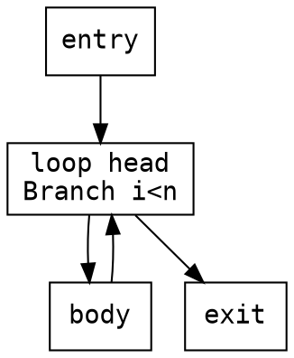

# graphviz `cfg` layout plugin

A standalone, **out-of-tree** graphviz layout engine that lays out control-flow
graphs in the Compiler Explorer / Cutter style: blocks on a grid, edges leaving
the bottom of a block and entering the top of the next, routed as orthogonal
right-angle lanes. Select it with `-Kcfg` (or `layout=cfg`).

It installs into a **stock, unmodified graphviz** — no fork, no rebuild of
graphviz. Everything else (every output format, every other engine) keeps
working normally.

## Example

The optimized IL control-flow graph of a Dart function
(`loop_and_branch.dart :: classify`), rendered with `dot -Kcfg`. The plugin does
the grid layout and orthogonal bottom-to-top edge routing; the per-token syntax
colors, optimizer "heatmap" row tints (e.g. the orange `CheckStackOverflow`
safepoint, the blue `CheckSmi` guard), dimmed plumbing (`ParallelMove`), and
colored branches all come from the input DOT's HTML-like labels. The generating
source is [`example/sample-cfg.dot`](example/sample-cfg.dot) — reproduce it with
`dot -Kcfg -Tpng example/sample-cfg.dot -o out.png`.


## Build & install

Requires a graphviz install discoverable via `pkg-config --exists libgvc`
(e.g. `brew install graphviz`) and a C compiler.

```sh
make            # build the shared library
make install    # copy into graphviz's plugin dir and run `dot -c`
make test       # render a sample CFG
```

Then:

```sh
dot -Kcfg -Tpng yourgraph.dot -o out.png
dot -Kcfg -Tsvg yourgraph.dot -o out.svg
```

`make uninstall` removes it and re-registers the remaining plugins.

## Usage

Standard DOT. One engine-specific attribute:

- `cfgbias=left|right` on an edge picks the vertical routing lane when the left
  and right candidate columns are equidistant. Default is `right`; set `left`
  for the classic "true branch goes left". Example:



## Subgraphs / clusters

`subgraph cluster_*` boxes are drawn (fill, border, and label), including nested
clusters, using the standard cluster attributes (`label`, `style`, `color`,
`pencolor`, `fillcolor`, `bgcolor`, `penwidth`, `labelloc`, …).

The whole graph is laid out by **one** `cfg_core` pass over all nodes and edges,
so every edge shares the same routing lanes and edges never overlap or overdraw
— including edges that cross cluster boundaries. Each cluster is then drawn as
the bounding box of its member nodes (recursively for nesting) plus an 8pt
margin and a reserved label band; `cfg_core` itself stays a pure,
grouping-agnostic function (all of this is glue in `cfg_layout.c`). Cluster
labels default to **top-left** (rather than graphviz's centered) so the edge
entering a single-entry cluster doesn't run through the label; set
`labeljust=c`/`r` to override.

Two limitations worth knowing:

- **Non-contiguous clusters.** Because the box is the bounding box of wherever
  the members landed, a cluster whose members are *not* a contiguous region of
  the layout can have a box that also encloses non-members. Real CFG clusters
  (loop bodies, regions) are contiguous, so this is rare; making it tight in
  general needs rank/ordering constraints (dot-level) that this engine doesn't
  implement.
- **Edge attach points.** A node with several edges on one side is widened (its
  minimum `width` is raised to fit the edge fan) so the edges attach *inside* the
  box rather than on its corners, and a fan-out source is wide enough that all
  its edges emanate from under it. Low-degree nodes are untouched. (Merge nodes
  are still positioned under one predecessor rather than centered — that's
  inherent to the grid algorithm, matching upstream Dart/CE.)

Plain (non-cluster) subgraphs and rank constraints (`rank=same`) are ignored —
the engine derives rows from the CFG itself.

## Limitations

- **Ports honor horizontal position only.** `node:port` / compass / record /
  HTML cell ports move where an edge attaches *along* a block's bottom (tail)
  or top (head) edge — so e.g. a switch block fans its out-edges from under the
  right cells. The CFG convention is kept: edges still leave the bottom and
  enter the top, so the side/compass (n/s/e/w) is not otherwise honored. The
  attach point is jogged after routing, so a ported edge can have an extra bend
  near the block; the routing lanes themselves are not port-aware.
- **Routing-lane spacing** is 18pt rather than upstream's 10pt — a deliberate
  divergence so each edge's final vertical approach stays longer than a rendered
  arrowhead (a 10pt lane lets graphviz's arrow clipping bend the last segment).

## Files

| File | Role |
|---|---|
| `cfg_core.{c,h}` | The layout algorithm. **No graphviz dependency** — a C port of Compiler Explorer's `graph-layout-core` (via the dart-il-explorer project). Sized nodes + edges in, node positions + orthogonal edge polylines out. |
| `cfg_layout.c` | Glue to graphviz: sizes nodes, runs `cfg_core` once over the whole graph, writes `ND_coord`, routes/installs edge splines (honoring `node:port`), draws cluster (`subgraph cluster_*`) boxes around their members, sets the bounding box, hands off to graphviz's normal post-processing/rendering. |
| `gvplugin_cfg.c` | Plugin registration (`gvplugin_cfg_LTX_library`). |
| `test/` | Fixture-based regression suite (`make check`). See `test/README.md`. |

## Testing

`make check` (or `test/run.sh`) renders every fixture under `test/fixtures/`
and diffs its `-Tdot` layout (node positions, edge splines, cluster boxes)
against a committed golden, grouped into `layout`, `edges`, `subgraphs`,
`ports`, and `realworld` categories. `test/compare-baseline.sh` additionally
asserts the flat layout/edge output is byte-identical to the `git HEAD` plugin.
Re-bless intentional changes with `test/gen-golden.sh`. Details in
[`test/README.md`](test/README.md).

## How it plugs in (and the one caveat)

graphviz layout engines are plugins: a shared library exporting
`gvplugin_<name>_LTX_library`, discovered via `dot -c`. The public plugin API
(`gvplugin.h`, `gvplugin_layout.h`, `types.h`, `geom.h`, `gvcjob.h`) is
installed by graphviz, so registration uses only public headers.

The glue, however, calls a handful of graphviz helpers that are **exported from
`libgvc` but not part of the documented public API** (`clip_and_install`,
`compute_bb`, `gv_nodesize`, `common_init_node`, `dotneato_postprocess`,
`setEdgeType`, `is_a_cluster`, `do_graph_label`, `free_label`, and the `State`
global). Their declarations are not in installed
headers, so `cfg_layout.c` declares the prototypes itself. This is what lets the
plugin work without a fork — but it couples the plugin to graphviz internals:
build it against the graphviz version you run, and expect a possible recompile
or small tweak across major graphviz releases. The algorithm core
(`cfg_core.c`) touches zero graphviz symbols and is unaffected.

## License

BSD 2-Clause — see [`LICENSE`](LICENSE). The layout algorithm in `cfg_core.c`
is a C port of Compiler Explorer's `graph-layout-core` (BSD 2-Clause), via the
dart-il-explorer project; attribution is retained in the license file.

## Status: a scrapped experiment

This was an experiment to see whether a control-flow-graph layout could be made
**nicer than what graphviz already produces** for CFGs — the compact,
block-on-a-grid, orthogonal-bottom-to-top style of Cutter / Compiler Explorer,
delivered as a drop-in `-Kcfg` engine on stock graphviz.

For the core job — laying out and routing a flat CFG of basic blocks — it works
well. The trouble was everything else graphviz supports. Once you bring in the
**advanced features** (clusters/subgraphs, record and HTML ports, edge labels,
rank constraints, node sizing/shape machinery), a from-scratch layout engine has
to re-implement a great deal that graphviz's own `dot` already does properly,
and it turned out to be much harder than expected to make those features look as
good. Clusters needed a single global routing pass to avoid edge overlaps but
then can't guarantee tight boxes around non-contiguous members; ports are a
post-routing approximation rather than true attachment; merge nodes aren't
centered; node boxes can't always be sized the way the shape code wants from a
minimal plugin. Each of these is solvable, but solving them well amounts to
re-doing what `dot` already implements — at which point the premise (a small,
nicer alternative engine) no longer holds.

So **this experiment was scrapped.** It's preserved here as a working artifact —
the flat CFG layout is genuinely good, the test suite (`test/`) documents both
what works and the limitations, and the renders under `test/render/` show the
state at which it was stopped — but it is not intended for further development.
